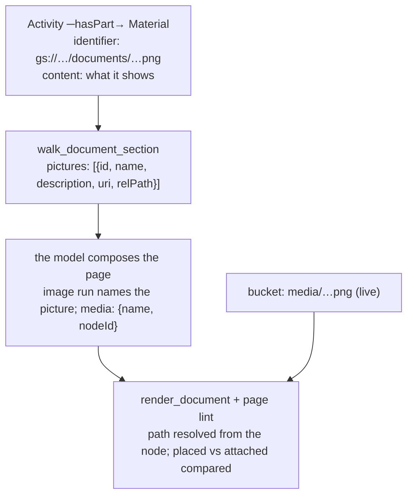

# Illustrations as `Material` nodes — a picture the graph can vouch for

> **Status: Built (2026-09-12), not yet deployed.** `attach_image`
> ([`kg-recipes/image.ts`](../../backend/src/kg-recipes/image.ts),
> [`server/document-authoring.ts`](../../backend/src/server/document-authoring.ts)),
> the `pictures` list on `walk_document_section`
> ([`curriculum/documents.ts`](../../backend/src/curriculum/documents.ts)), the
> `{name, nodeId}` media form on `render_document`
> ([`server/render.ts`](../../backend/src/server/render.ts)) and the two page rules
> ([`curriculum/lint-page.ts`](../../backend/src/curriculum/lint-page.ts)).
> **Revised the same day**: the `metadata.media` sidecar was dropped for the
> canonical `identifier` — see *What was dropped*. **ci/maths migrated live the
> same day** (`scripts/extract-docx-pictures.mjs` + `scripts/migrate-pictures.mjs`):
> 522 picture nodes, one per `[IMAGE : slug]` marker of the student book, 215
> with their file, 307 commissioned; each section keeps one marker line naming
> its picture and the guide's references were renamed to match.

## The problem

Until now an image existed in exactly two places: as a file in the documents
bucket (`create_media_upload_url`) and as a name in the block tree a page was
composed from. The graph knew nothing about it. Three things followed:

- **Nobody could list them.** `list_documents` and `reconcile` see `.docx` only, by
  design, and nothing else enumerated the media area. "Which images exist for
  lesson 22?" had no answer short of guessing paths.
- **Nothing recorded what a picture meant.** Two wrong answer keys reached print
  because the words and the picture each made sense and disagreed. The picture's
  meaning lived in a generation prompt nobody kept.
- **Approval and retirement had no state.** A regenerated file overwrote an
  approved one silently unless a naming convention was followed by hand.

The self-serve map ([`self-serve-authoring.md`](self-serve-authoring.md)) showed the
illustrator's column carrying the red cells for exactly these reasons.

## The decision

A picture is a **`Material`** node under the **Lesson or Activity it illustrates**,
attached by the canonical `hasPart`, and every field it needs is one Learning
Commons already defines. There is no sidecar.

| field (all LC) | holds | why there |
|---|---|---|
| `identifier` | the file's URI — `gs://<bucket>/<namespace key>/documents/<relPath>` | LC says an identifier is "a string or a URI". For a picture it IS the locator: the graph says where the bytes are with no field of our own. Formed by the server once the file is known to exist; resolved back by checking the bucket and the namespace, so a graph moved to another deployment refuses rather than reads the wrong object |
| `content` (required on a Material) | what the picture SHOWS, in words | sits beside the activity's own text, so a reviewer — or `review_draft` — can read both and see whether they agree |
| `name` | the name a page places it by (an image run's `media`) | unique among the pictures of one parent, checked at attach time |
| `materialType` | `Supporting` | the picture supports the activity's text; it is not the core material |

A plain `Material` (a routine step, a formatter spec) keeps its node id as
`identifier`; a picture is told apart by an identifier that is an object URI
naming an image file. That is the whole discriminator, and it is read off
canonical fields.

**What was dropped, and where it went.** An earlier cut of this design kept a
`metadata.media` sidecar with the path, a version number and an approval flag.
Each has a canonical home instead:

- *location* → `identifier`, above;
- *version* → a new version of a picture is a new file, hence a new URI, hence a
  new node: attach again, retire the old one (`delete_nodes`). The audit keeps
  the sequence;
- *approval* → publishing the draft that attached it, by an approver, is the
  approval — exactly as for any authored text. Nothing about a picture needs a
  second approval mechanism.

**Why `Material` and not `ClassroomMaterial`.** Both are LC labels. A
`ClassroomMaterial` is a teacher-facing classroom resource a lesson `uses`
(counters, a chalkboard), and it is a gated label whose fields the ontology does
not publish. A `Material` is the content leaf that hangs inside a Lesson or
Activity, which is what an illustration is.

**Why under the content and not under the section.** The same vignette serves
the pupil book and the teacher's guide. Attached to the activity, it reaches
every section covering that activity through the `covers` walk the readers
already make. Attached to a section, it would belong to one document.

**Why a task verb.** The self-serve note's test: a task verb earns its place only
when it enforces a multi-element invariant a primitive can silently violate. Here
the invariant is that the node points at a file that exists. `add_nodes` with a
mistyped path is a valid write and a picture that never renders. `attach_image`
probes the bucket before the dry-run and refuses, naming the path.

**Commissioning.** A picture is usually described before it is drawn — the
curriculum expert writes the brief, the illustrator delivers weeks later. So
`attach_image` takes `commissioned:true`, which waives only the bucket check:
the node is created with the brief as its `content` and an identifier naming
the path the file MUST take. Delivery is then an upload to that path and
nothing else; no graph edit, no second approval. Until it lands, a render that
places the picture refuses it by name, which is the honest state of a page
waiting on its illustrator. The ci/maths migration of 2026-09-12 created 307
pictures this way, beside 215 whose files came from the experts' documents.

## What the file and the node each are

The **file** stays live in the bucket, uploaded once through the signed URL, with
no draft and no undo — like a document. The **reference** is a draft edit:
staged, diffed, undoable, audited, published with the graph. An unreferenced
upload is harmless; a reference to a missing file is refused. That split mirrors
how documents already work and keeps the bucket free of graph semantics.

One consequence worth stating: the URI names the deployment's bucket. A graph
exported from production and imported into another environment carries
production URIs, and a render there refuses each picture by name rather than
reading a same-named object from the wrong bucket. That is the honest answer for
a locator, and a migration that moves the files rewrites the identifiers.

## How it reaches the page

1. **Read.** `walk_document_section` already walks from the section across `covers`
   and down `hasPart`/`hasChild`, so an attached Material rides in the curriculum
   slice unchanged. What was added is the projection: a `pictures` list on the
   first page of every section read, sent whatever `include` says, because it is
   a few small rows and the one thing a composer must have to name a picture
   correctly. `preview_generation` inherits it.
2. **Compose and render.** A `media` entry may now be `{name, nodeId}`. The server
   reads the path off the node's identifier, from the same graph the render resolves
   from (draft when one is open), so a composer copies an id and never
   transcribes a path. A node that is not a picture is refused by name.
3. **Check.** Two page rules in `lint_content`, both warnings:
   `page-picture-not-attached` (the page places a picture no attached node
   accounts for, by node id or by name) and `page-picture-unplaced` (an attached
   picture the page leaves out — the image twin of the unused-routine check).
   Both stay silent when the caller did not resolve the attached list, because
   silence must never read as a clean verdict.

## What this does not do

- It does not look at pixels. Whether the drawn picture matches its description
  is still eyes-on work; the `illustrations` skill says so. What changed is that
  the description now exists in the graph, beside the text, for those eyes.
- It does not list the bucket. An image uploaded and never attached is still
  invisible. Attaching is the act that makes a picture part of the material.
- It does not migrate existing images. The live sheets carry pictures by path;
  they keep rendering, and the not-attached rule nudges each one into the graph
  as it is next touched.
